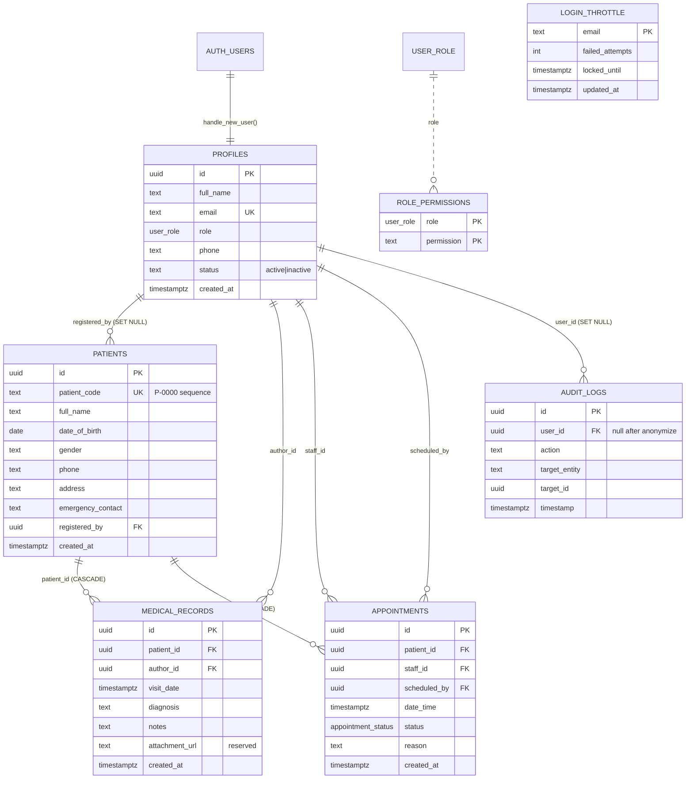
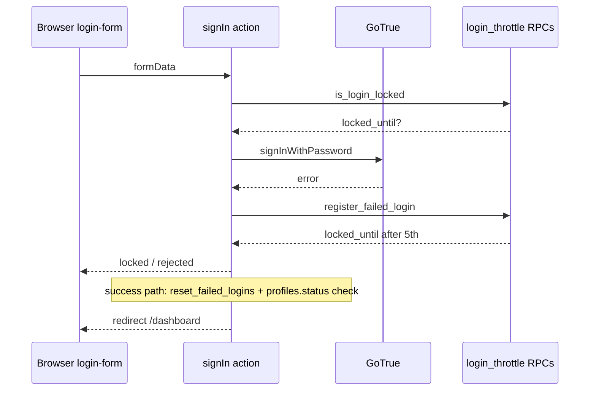
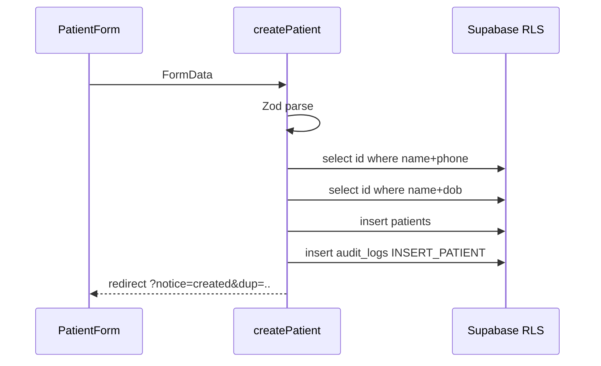
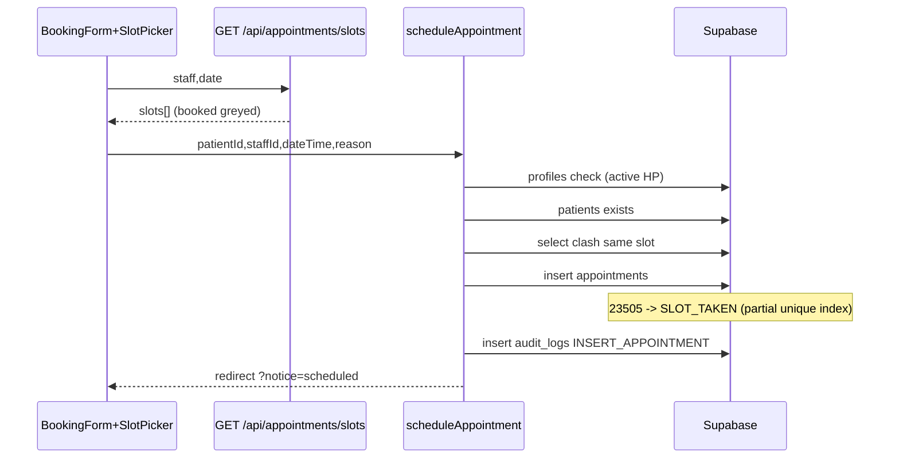
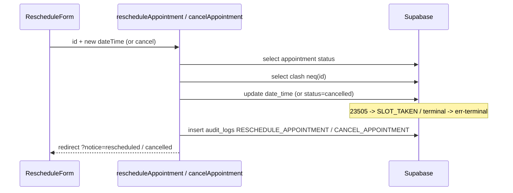
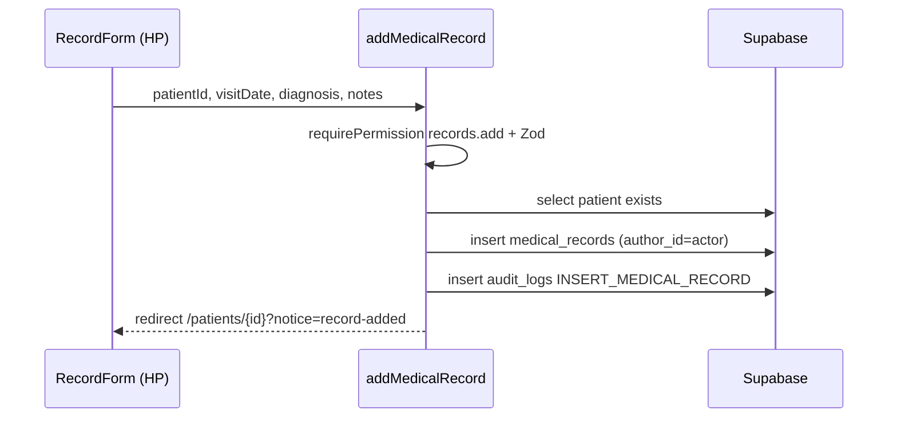
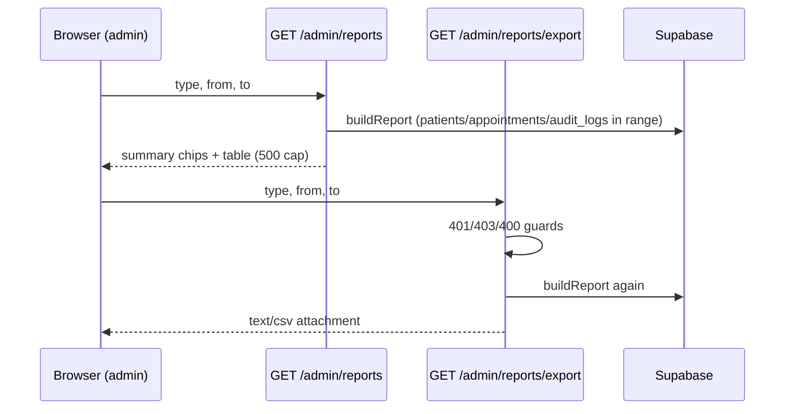
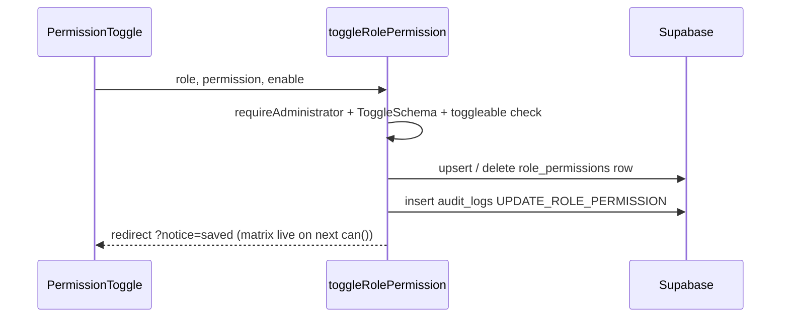
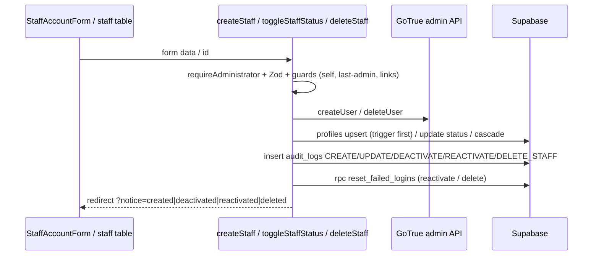

# PRAAMS Architecture Dossier (SDD + ODD source material)

Compiled 2026-08-29 from the source code directly (read-only pass). Every claim cites a file and, where practical, line numbers. `NOT FOUND` marks anything absent; `INFERRED` marks rationale not written in code/docs. Secret values are omitted by rule; env var NAMES and seed emails/roles are listed with passwords redacted.

## 1. Stack and tooling

Source: `package.json` (32 lines, read in full).

### Runtime dependencies

| Package | Version | Use in this project |
|---|---|---|
| `@supabase/ssr` | ^0.12.5 | `createServerClient`/`createBrowserClient` for cookie-based Supabase sessions in `proxy.ts`, `lib/supabase/server.ts`, `lib/supabase/client.ts` |
| `@supabase/supabase-js` | ^2.112.4 | Core Supabase client: PostgREST queries, GoTrue auth (`auth.admin.createUser`/`deleteUser`, `rpc()`), used by `lib/supabase/admin.ts` and `scripts/seed.ts` |
| `next` | 16.3.3 | App Router framework: pages, Server Components, Server Actions, Route Handlers, `proxy.ts` (Next 16 renamed middleware; `next.config.ts:11` `devIndicators: false`) |
| `react` | 19.2.8 | UI runtime (RSC + client components) |
| `react-dom` | 19.2.8 | DOM renderer; `useFormStatus` in `components/permission-toggle.tsx:3` |
| `server-only` | ^0.0.1 | Build-time guard so `lib/supabase/admin.ts` (service-role) cannot be imported into client bundles (`lib/supabase/admin.ts:1`) |
| `zod` | ^4.4.3 | Validation schemas shared by client forms and server actions (`lib/validation/*.ts`) |

### Dev dependencies

| Package | Version | Use in this project |
|---|---|---|
| `@tailwindcss/postcss` | ^4 | Tailwind v4 PostCSS plugin (`postcss.config.mjs`) |
| `@types/node` | ^20 | Node types for `scripts/seed.ts` etc. |
| `@types/react` / `@types/react-dom` | ^19 | React types |
| `eslint` | ^9 | Linter (`npm run lint`) |
| `eslint-config-next` | 16.3.3 | Next core-web-vitals + TS rules (`eslint.config.mjs:2-3`) |
| `tailwindcss` | ^4 | Styling; tokens defined in `app/globals.css` `@theme` block |
| `tsx` | ^4.23.12 | Runs `scripts/seed.ts` (`npm run db:seed`) |
| `typescript` | ^5 | Type checking in `npm run build` |

### Scripts, Node, tests

| Script | Command |
|---|---|
| `dev` | `next dev` |
| `build` | `next build` |
| `start` | `next start` |
| `lint` | `eslint` |
| `db:seed` | `tsx --env-file=.env.local scripts/seed.ts` |

- Node version constraint: NOT FOUND. `package.json` has no `engines` field; no `.nvmrc`.
- Test framework: NOT FOUND. No vitest/jest/playwright config files exist and no `test` script is defined. (`docs/` Test Plan docx names Vitest/Jest as planned tools, but none is installed.)
- TypeScript config: `strict: true`, target ES2017, path alias `@/*` -> `./*` (`tsconfig.json:7,21-23`).

## 2. Folder and package map

| Path | Purpose | Main files | Imports from / imported by |
|---|---|---|---|
| `app/` | Next.js App Router root | `layout.tsx` (fonts, SkipLink, IdleCookieWatcher), `globals.css` (design tokens), `error.tsx`, `not-found.tsx`, `page.tsx` (stub redirect to /dashboard, `app/page.tsx:8-10`) | imports `components/`, `lib/`; rendered by Next |
| `app/login/` | UC-01 screen | `page.tsx` (server; reads `?reason=`), `login-form.tsx` (client; `useActionState(signIn)`) | calls `lib/actions/auth`; uses `lib/validation/auth` types |
| `app/(app)/` | Authenticated route group; owns the persistent shell so the sidebar never remounts (`app/(app)/layout.tsx:8-13`) | `layout.tsx` | imports `lib/auth/session`, `lib/supabase/server`, `components/app-shell` |
| `app/(app)/dashboard/` | Role-specific workspaces | `page.tsx` (340 lines, server), `loading.tsx` | imports `components/dashboard/*`, `lib/permissions/data`, `lib/time`, `lib/constants` |
| `app/(app)/patients/` | UC-04..08 | `page.tsx` (register/search, 277), `new/`, `[id]/page.tsx` (291), `[id]/edit/`, `[id]/records/new/`, `loading.tsx` x2 | actions `lib/actions/patients`; components `patient-form`, `record-form`, `patient-search-combobox` |
| `app/(app)/appointments/` | UC-09..11 | `page.tsx` (330, calendar), `new/`, `[id]/page.tsx` (175), `loading.tsx` | actions `lib/actions/appointments`; `components/schedule/*`, `slot-picker` |
| `app/(app)/admin/` | UC-02/03/12 | `staff/` (list 166, `new/`, `[id]/` 159, loading), `permissions/page.tsx` (91), `reports/page.tsx` (168), `reports/export/route.ts` (32, CSV), `reports/loading.tsx` | actions `lib/actions/staff`, `lib/actions/permissions`, `lib/reports/data` |
| `app/api/` | Route Handlers (JSON/CSV) | `appointments/slots/route.ts` (50), `patients/search/route.ts` (27) | import `lib/auth/session`, `lib/supabase/server`, `lib/constants` |
| `components/` | UI (mixed server/client) | see subsystem map in section 6 | client components import `lib/actions/*` + `lib/validation/*` types; pure UI imports only each other |
| `components/schedule/` | Calendar widgets | `time-grid.tsx` (222), `month-grid.tsx` (108), `mini-calendar.tsx` (127, client), `side-panel.tsx` (156) | import `lib/time`, `lib/constants` |
| `components/dashboard/` | Role dashboards | `admin-dashboard.tsx` (147), `receptionist-dashboard.tsx` (171), `hp-dashboard.tsx` (137), `card.tsx` (191) | pure presentational; receive props from `app/(app)/dashboard/page.tsx` |
| `lib/actions/` | Server Actions ("use server") | `auth.ts` (98), `patients.ts` (220), `appointments.ts` (206), `staff.ts` (266), `permissions.ts` (53) | import `lib/audit`, `lib/auth/session`, `lib/validation/*`, `lib/supabase/{server,admin}`, `lib/permissions/data`, `lib/constants` |
| `lib/auth/session.ts` | Request-cached current profile + guards | `getCurrentProfile`, `requireAdministrator`, `requirePermission` (55 lines) | imports `lib/supabase/server`, `lib/permissions/data` (lazy) |
| `lib/audit.ts` | Shared audit writer (29 lines) | `writeAuditLog` | imports `lib/supabase/server`, `types/database` |
| `lib/permissions/data.ts` | UC-03 catalogue + matrix reader (60 lines) | `TOGGLEABLE_PERMISSIONS`, `PERMISSION_LABELS`, `getGrantedMatrix`, `can`, `ALL_ROLES` | imports `lib/supabase/server` |
| `lib/reports/data.ts` | UC-12 report engine + CSV (157 lines) | `buildReport`, `toCsv`, `REPORT_TYPES`, `validRange`, `isReportType` | imports `lib/constants`, `lib/supabase/server` |
| `lib/supabase/` | Client factories | `server.ts` (34, anon+cookies, RLS-scoped), `admin.ts` (22, service-role, `server-only`), `client.ts` (11, browser; currently UNUSED - no call sites found) | - |
| `lib/validation/` | Zod schemas | `auth.ts` (31), `patient.ts` (69), `staff.ts` (45), `appointments.ts` (34) | imported by both client forms and server actions |
| `lib/constants.ts`, `lib/time.ts`, `lib/ui.ts` | Clinic constants; Addis time helpers; theme strings | see section 7 | imported by pages, actions, components |
| `types/database.ts` | Hand-mirrored DB types (83 lines) | `ProfileRow`, `PatientRow`, `MedicalRecordRow`, `AppointmentRow`, `AuditLogRow`, `RolePermissionRow` + Insert/Update variants | imported by lib and pages |
| `supabase/migrations/` | 5 SQL migrations (applied via Dashboard SQL Editor, not CLI) | see section 4 | - |
| `scripts/seed.ts` | Idempotent demo seed via GoTrue admin API (270 lines) | - | uses service-role key |
| `proxy.ts` (repo root) | Next 16 proxy (middleware): session refresh, idle timeout, route gating (86 lines) | - | imports `lib/constants` |
| `docs/` | Project docs: `RAAMS_Requirements_Specification.md`, `PRAAMS_Coding_Agent_Brief.md`, `PRAAMS_Audit_Report.md`, Requirement-analysis PDF, `diagrams/` PNGs | - | reference only |
| `public/` | Scaffold SVGs (file/globe/next/vercel/window) - unused by the app UI | - | - |
| Root configs | `next.config.ts`, `tsconfig.json`, `eslint.config.mjs`, `postcss.config.mjs`, `.gitignore` (`.env*` ignored), `.env.local` (3 vars) | - | - |

### Layering rules observed (verified by import scan)

1. `lib/*` never imports from `app/` or `components/` (no reverse dependency found).
2. Server Components (pages) never mutate; all mutations go through `lib/actions/*` Server Actions invoked from client-component `<form action={...}>` (e.g. `components/patient-form.tsx:5`, `components/permission-toggle.tsx:5`).
3. Client components never import `lib/supabase/server` or `lib/supabase/admin`; the browser factory `lib/supabase/client.ts` exists but has zero call sites (searched `createSupabaseBrowserClient`: only its definition) - client data access goes through `/api/*` Route Handlers instead (`components/slot-picker.tsx:50`, `components/patient-search-combobox.tsx:49`).
4. `lib/supabase/admin.ts` is protected by `import "server-only"` (`lib/supabase/admin.ts:1`) so it cannot reach client bundles.
5. `lib/validation/*` is the only shared client/server boundary code (schemas + plain TS types).
## 3. Runtime architecture and hardware/software mapping

### What runs where

| Tier | Runs | Files |
|---|---|---|
| Browser | Client Components: login form, patient/record/staff/booking/reschedule forms, patient-search combobox, slot picker, topbar search, shell nav (active-link tracking), mini calendar, toasts, permission toggle, confirm buttons, print button, idle activity stamper | files under `app/login/`, `components/` marked `"use client"` (13 files) |
| Browser | `fetch` calls to internal Route Handlers only: `/api/appointments/slots` (`components/slot-picker.tsx:50`), `/api/patients/search` (`components/patient-search-combobox.tsx:49`) | - |
| Next.js server - Server Components | All pages under `app/(app)/**` + login page; every list/detail view is rendered server-side with direct PostgREST queries | e.g. `app/(app)/patients/page.tsx:49-82` |
| Next.js server - Server Actions | All mutations (`lib/actions/*`); invoked from client forms via `useActionState` or plain `<form action={fn}>` | `lib/actions/auth.ts`, `patients.ts`, `appointments.ts`, `staff.ts`, `permissions.ts` |
| Next.js server - Route Handlers | `GET /api/appointments/slots` (slot availability), `GET /api/patients/search` (lookup), `GET /admin/reports/export` (CSV download) | 3 `route.ts` files |
| Next.js server - proxy (middleware) | Every navigation: refreshes Supabase auth cookies, validates JWT via `getUser()`, enforces idle timeout, gates protected paths | `proxy.ts:25-92` |
| Supabase Postgres | All tables + RLS; two security-definer login-throttle RPCs; `handle_new_user()` trigger on `auth.users`; partial unique indexes for slot conflicts | `supabase/migrations/*` |
| Supabase Auth (GoTrue) | Password sign-in (`signInWithPassword`), admin user create/delete/list (service-role) | `lib/actions/auth.ts:58`, `lib/actions/staff.ts:80,306`, `scripts/seed.ts:86,105` |
| Supabase features NOT used | Storage (no bucket; `medical_records.attachment_url` is a reserved column with no upload UI - `supabase/migrations/20260827000000_init_praams.sql:44`), Realtime, Edge Functions, foreign-data wrappers, DB webhooks | - |

### Supabase clients and every service-role call site

| Factory | Key | Where created | Used for | Why |
|---|---|---|---|---|
| `createSupabaseServerClient()` | anon key + user cookies | `lib/supabase/server.ts:13-36` | ALL page reads, ALL RLS-scoped mutations, audit inserts | "every query runs as the signed-in user and stays subject to RLS" (`lib/supabase/server.ts:7-8`) |
| `createSupabaseAdminClient()` | service-role (bypasses RLS) | `lib/supabase/admin.ts:17-23` | see call sites below | privileged ops outside RLS reach |
| `createBrowserClient` wrapper | anon key | `lib/supabase/client.ts:7-12` | NO CALL SITES (unused today) | - |
| `createServerClient` (inline) | anon key | `proxy.ts:28-45` | JWT validation + cookie refresh per navigation | "getUser() validates the JWT against the Auth server" (`proxy.ts:47-48`) |
| `createClient` (script) | service-role | `scripts/seed.ts:26-28` | seeding | creates auth users outside RLS |

Service-role (`createSupabaseAdminClient`) call sites, exhaustive:

1. `lib/actions/auth.ts:41` - `admin.rpc("is_login_locked")` (line 44), `admin.rpc("register_failed_login")` (line 64), `admin.rpc("reset_failed_logins")` (line 85) - login throttle RPCs.
2. `lib/actions/staff.ts:64` - `admin.auth.admin.createUser` (line 80), `admin.from("profiles").upsert` (line 97), `admin.auth.admin.deleteUser` (line 306), `admin.rpc("reset_failed_logins")` (line 309).
3. `lib/actions/staff.ts:273` (in `deleteStaff`) - same admin client for `deleteUser` + `reset_failed_logins`.
4. `scripts/seed.ts:26` - standalone script (not part of the Next.js runtime).

### Environment variables (names only)

| Name | Purpose |
|---|---|
| `NEXT_PUBLIC_SUPABASE_URL` | Supabase project URL; used by all client factories + seed |
| `NEXT_PUBLIC_SUPABASE_ANON_KEY` | Public anon key; RLS-scoped requests |
| `SUPABASE_SERVICE_ROLE_KEY` | Server-only key bypassing RLS; used by `lib/supabase/admin.ts` and `scripts/seed.ts`; never `NEXT_PUBLIC_`-prefixed (`lib/supabase/admin.ts:11-12`) |

(.env.local contains exactly these 3 names; values redacted per security rule.)

### Running locally / deploying

- Local: apply the 5 migration files by pasting them into Supabase Dashboard -> SQL Editor (README: "Apply BOTH schema migrations"; code header of each migration repeats this), then `npm run db:seed`, then `npm run dev` (http://localhost:3000; bare `/` redirects to `/dashboard` via `app/page.tsx:8-10`, real routing in `proxy.ts:77-89`).
- Deployment config in repo: NOT FOUND (no vercel.json / Dockerfile / standalone output). `next.config.ts` only sets `turbopack.root` (line 6-8) and `devIndicators: false` (line 11). Deployment target is not encoded in code; `Documentation.MD` mentions "Supabase + Vercel" as an infra assumption for NFR-04 (doc claim, not code).

### Cookies / web storage

| Name | Type | Purpose | Source |
|---|---|---|---|
| `sb-<project-ref>-auth-token` (+ chunks) | httpOnly cookie set by `@supabase/ssr` | Supabase Auth session (JWT + refresh) | `proxy.ts:32-44`, `lib/supabase/server.ts:20-34` (getAll/setAll plumbing) |
| `praams_last_active` | first-party, `samesite=lax`, `path=/`, max-age 7200s | epoch-ms of last user activity for FR-05 idle termination; refreshed at most every 15s on pointer/key/wheel/focus events | `lib/constants.ts:18`, `components/idle-cookie-watcher.tsx:20-23`, read in `proxy.ts:60` |
| localStorage / sessionStorage | NOT FOUND | no usage anywhere (searched) | - |
## 4. Data persistence

### Migration files (in order; all applied by pasting into Supabase SQL Editor)

1. `supabase/migrations/20260827000000_init_praams.sql` (150 lines) - enums, 5 tables, indexes, patient_code deviation, RLS starter policies, `handle_new_user()` trigger.
2. `supabase/migrations/20260827000010_login_security.sql` (71 lines) - `login_throttle` table + 3 security-definer RPCs.
3. `supabase/migrations/20260827000020_role_permissions.sql` (63 lines) - `role_permissions` table, default grants, FK relaxations to `ON DELETE SET NULL`.
4. `supabase/migrations/20260827000030_appointment_slots.sql` (18 lines) - two partial unique indexes.
5. `supabase/migrations/20260827000040_profiles_directory_rls.sql` (13 lines) - `profiles_staff_read` policy.

### Tables (current schema)

**profiles**

| Column | Type | Null | Default |
|---|---|---|---|
| id | uuid | NOT NULL | - |
| full_name | text | NOT NULL | - |
| email | text | NOT NULL | UNIQUE |
| role | user_role | NOT NULL | - |
| phone | text | null | - |
| status | text | NOT NULL | 'active' |
| created_at | timestamptz | NOT NULL | now() |

- PK: `id`; FK: `id references auth.users(id) on delete cascade` (000000:16); CHECK: `status in ('active','inactive')` (000000:21).

**patients**

| Column | Type | Null | Default |
|---|---|---|---|
| id | uuid | NOT NULL | gen_random_uuid() |
| full_name | text | NOT NULL | - |
| date_of_birth | date | NOT NULL | - |
| gender | text | NOT NULL | - |
| phone | text | null | - |
| address | text | null | - |
| emergency_contact | text | null | - |
| registered_by | uuid | null | - |
| created_at | timestamptz | NOT NULL | now() |
| patient_code | text | NOT NULL | 'P-' \|\| lpad(nextval('patient_code_seq')::text, 4, '0') |

- PK: `id`; UNIQUE: `email`-style none, `patient_code text not null unique` (000000:85); FKs: `registered_by -> profiles(id)` originally NO ACTION, relaxed in 000020:66-70 to `ON DELETE SET NULL`; `gender` has no CHECK (validated in Zod only).
- patient_code deviation SQL, verbatim (000000:84-90):
```sql
alter table patients add column patient_code text not null unique;
create sequence patient_code_seq start with 232 owned by patients.patient_code;
alter table patients
  alter column patient_code
  set default 'P-' || lpad(nextval('patient_code_seq')::text, 4, '0');
```

**medical_records**

| Column | Type | Null | Default |
|---|---|---|---|
| id | uuid | NOT NULL | gen_random_uuid() |
| patient_id | uuid | NOT NULL | - |
| author_id | uuid | NOT NULL | - |
| visit_date | timestamptz | NOT NULL | now() |
| diagnosis | text | NOT NULL | - |
| notes | text | null | - |
| attachment_url | text | null | - (reserved, no UI) |
| created_at | timestamptz | NOT NULL | now() |

- PK: `id`; FKs: `patient_id -> patients(id) on delete cascade`, `author_id -> profiles(id)` (NO ACTION; delete of an author is refused app-side, 000020:19-21).

**appointments**

| Column | Type | Null | Default |
|---|---|---|---|
| id | uuid | NOT NULL | gen_random_uuid() |
| patient_id | uuid | NOT NULL | - |
| staff_id | uuid | NOT NULL | - |
| scheduled_by | uuid | NOT NULL | - |
| date_time | timestamptz | NOT NULL | - |
| status | appointment_status | NOT NULL | 'scheduled' |
| reason | text | null | - |
| created_at | timestamptz | NOT NULL | now() |

- PK: `id`; FKs: `patient_id -> patients(id) on delete cascade`, `staff_id -> profiles(id)`, `scheduled_by -> profiles(id)` (both NO ACTION).

**audit_logs**

| Column | Type | Null | Default |
|---|---|---|---|
| id | uuid | NOT NULL | gen_random_uuid() |
| user_id | uuid | null | - |
| action | text | NOT NULL | - |
| target_entity | text | null | - |
| target_id | uuid | null | - |
| timestamp | timestamptz | NOT NULL | now() |

- PK: `id`; FK: `user_id -> profiles(id)` relaxed in 000020:60-64 to `ON DELETE SET NULL` ("audit rows survive; the deleted actor is anonymized").

**login_throttle** (000010:12-17)

| Column | Type | Null | Default |
|---|---|---|---|
| email | text | NOT NULL | - |
| failed_attempts | integer | NOT NULL | 0 |
| locked_until | timestamptz | null | - |
| updated_at | timestamptz | NOT NULL | now() |

- PK: `email`. RLS enabled, ZERO policies (service-role RPC path only).

**role_permissions** (000020:26-30)

| Column | Type | Null | Default |
|---|---|---|---|
| role | user_role | NOT NULL | - |
| permission | text | NOT NULL | - |

- PK: `(role, permission)`.

### Enums

- `user_role`: 'receptionist', 'healthcare_professional', 'administrator' (000000:10)
- `appointment_status`: 'scheduled', 'completed', 'cancelled', 'no_show' (000000:11)

### Indexes

```sql
-- 000000:68-73
create index on patients (full_name);
create index on patients (phone);
create index on appointments (date_time);
create index on appointments (staff_id);
create index on medical_records (patient_id);
-- 000030:12-19
create unique index if not exists appointments_one_active_per_slot
  on public.appointments (staff_id, date_time)
  where status = 'scheduled';
create unique index if not exists appointments_patient_one_active_per_slot
  on public.appointments (patient_id, date_time)
  where status = 'scheduled';
```
Plus the implicit unique constraint on `patients.patient_code` (000000:85) and `profiles.email` (000000:18).
### Functions / RPCs / triggers (verbatim SQL)

**auth_role()** (000000:101-104):
```sql
create or replace function auth_role() returns user_role as $$
  select role from profiles where id = auth.uid();
$$ language sql security definer stable
set search_path = public; -- DEVIATION(hardening): pin search_path on SECURITY DEFINER fn
```

**handle_new_user() + trigger** (000000:146-167):
```sql
create or replace function public.handle_new_user()
returns trigger
language plpgsql
security definer
set search_path = public
as $$
begin
  insert into public.profiles (id, full_name, email, role)
  values (
    new.id,
    coalesce(new.raw_user_meta_data->>'full_name', split_part(new.email, '@', 1)),
    new.email,
    coalesce((new.raw_user_meta_data->>'role')::user_role, 'receptionist')
  )
  on conflict (id) do nothing;
  return new;
end;
$$;

create trigger on_auth_user_created
  after insert on auth.users
  for each row execute procedure public.handle_new_user();
```

**is_login_locked(p_email text) returns timestamptz** (000010:24-33): security definer, stable; `select case when locked_until > now() then locked_until end from public.login_throttle where email = lower(p_email);`

**register_failed_login(p_email text) returns timestamptz** (000010:35-69): security definer, volatile; upserts `failed_attempts` (counter restarts once a previous lock expired), then `if v_attempts >= 5 then update public.login_throttle set locked_until = now() + interval '30 minutes' where email = lower(p_email); end if;` and returns the resulting `locked_until`.

**reset_failed_logins(p_email text) returns void** (000010:71-79): `delete from public.login_throttle where email = lower(p_email);`

Views: NOT FOUND. Stored procedures beyond the above: NOT FOUND.

### Current schema vs original brief design (brief section 4, docs/PRAAMS_Coding_Agent_Brief.md:32-99)

The brief's five CREATE TABLE statements are byte-identical to migration 000000 for profiles, patients, medical_records, appointments, audit_logs (checked line by line), except the two FK relaxations and the additions below.

| Table | Verdict | Detail |
|---|---|---|
| profiles | MATCHES | all 7 columns identical to brief:42-50 |
| patients | CHANGED + ADDED | columns identical to brief:52-62 EXCEPT `registered_by` FK now `ON DELETE SET NULL` (000020:66-70) = CHANGED; `patient_code` + sequence = ADDED (000000:84-90) |
| medical_records | MATCHES | identical to brief:64-73 incl. `attachment_url` |
| appointments | ADDED (constraints) | columns identical to brief:75-86; two partial unique indexes ADDED (000030) |
| audit_logs | CHANGED | columns identical to brief:85-93; `user_id` FK now `ON DELETE SET NULL` (000020:60-64) |
| login_throttle | ADDED | not in brief section 4 (implements UC-01 lockout) |
| role_permissions | ADDED | not in brief section 4 (implements UC-03/FR-04); flagged DEVIATION in 000020:5-8 |

### Mermaid erDiagram (current schema)


## 5. Access control and security

### Authentication flow, end to end

1. GET /login renders `app/login/page.tsx`; `?reason=idle` shows the banner "You were signed out automatically after a period of inactivity." (`app/login/page.tsx:8-11`).
2. Submit -> Server Action `signIn` (`lib/actions/auth.ts:17-109`): Zod-parse `LoginFormSchema`; on failure return `status:"field-error"` (lines 24-35).
3. Lockout pre-check: `admin.rpc("is_login_locked", { p_email })`; locked -> return `status:"locked"` with formatted unlock time (44-54).
4. Credential check: `supabase.auth.signInWithPassword({ email, password })` through the anon/RLS client (56-61). "the password never leaves this scope except inside the Supabase Auth request; it is never logged or echoed back (NFR-03)" (38-39).
5. On error: `admin.rpc("register_failed_login")`; if it returns a lock instant -> `status:"locked"`; else `status:"rejected"` "Incorrect email or password." (63-82).
6. On success: `admin.rpc("reset_failed_logins")` (85-86), `getUser()` (88), read `profiles.status` via RLS (92-96); deactivated -> `signOut()` + rejection message (98-105).
7. Redirect to `/dashboard` (108). Role-specific rendering happens in `app/(app)/dashboard/page.tsx` (three branches: administrator line 162, receptionist line 196, HP line 309).
8. Logout: Server Action `signOut()` -> `supabase.auth.signOut()` -> redirect `/login` (`lib/actions/auth.ts:112-116`); wired in `components/app-shell.tsx:60-69` (mobile icon) and `:101-109` (desktop).
9. Session cookies are refreshed on every navigation by `proxy.ts` (setAll plumbing, lines 32-44).

### proxy.ts rules (file: `proxy.ts`, 86 lines, verbatim behavior)

| Rule | Detail |
|---|---|
| Public paths | `PUBLIC_PATHS = new Set(["/", "/login"])` (`proxy.ts:7`) |
| Protected prefixes | `["/dashboard","/patients","/appointments","/admin","/api"]` (`proxy.ts:8-14`) |
| Matcher | `/((?!_next|favicon.ico|.*\\.(?:svg|png|jpg|jpeg|gif|webp|ico|txt|xml|woff2?)$).*)` (`proxy.ts:95-97`) |
| JWT validation | `supabase.auth.getUser()` per request; network error -> treat as guest (`proxy.ts:49-54`) |
| Idle timeout (FR-05) | If user and protected path: read cookie `praams_last_active`; if `Date.now() - lastActive > INACTIVITY_TIMEOUT_MS` (30 min, `lib/constants.ts:13-15`) -> `supabase.auth.signOut()`, redirect `/login?reason=idle`, delete `sb-*` cookies + the activity cookie (`proxy.ts:59-74`). Cookie is stamped client-side by `components/idle-cookie-watcher.tsx` (max 1 write / 15s; mount counts as activity, line 25). NOTE (gap): the idle check runs only in the proxy, i.e. on navigations - not inside Server Actions. |
| Guest gate | `!user && !PUBLIC_PATHS.has(path)` -> redirect `/login` (`proxy.ts:77-79`) |
| Logged-in on /login | redirect `/dashboard` (`proxy.ts:81-83`) |
| Bare `/` | redirect `/dashboard` or `/login` by session (`proxy.ts:85-89`) |
| Role checks here | deliberately absent: "Optimistic checks only - role-level authorization is enforced where it is trustworthy (server components/server actions backed by RLS), never here." (`proxy.ts:22-24`) |
| Redirect reasons | only `reason=idle` exists; `REASON_NOTICES` map has the single `idle` key (`app/login/page.tsx:9-11`) |

### Account lockout (UC-01)

- Table `login_throttle` (RLS on, zero policies); constants `LOCKOUT_MAX_ATTEMPTS = 5`, `LOCKOUT_DURATION_MINUTES = 30` (`lib/constants.ts:11-12`), mirrored in SQL (000010:6-7, 61-64).
- Counters are consecutive failures per email; reset on success (auth.ts:85) and automatically on expiry (000010:49-54). Reactivation of a staff account also clears the counter: `admin.rpc("reset_failed_logins")` (`lib/actions/staff.ts:242-245`), as does hard delete (`staff.ts:309`).
- Locked sign-ins are refused BEFORE touching Auth (auth.ts:43-54) with message "This account is temporarily locked after too many failed attempts. You can try again after HH:mm East Africa Time." (`formatLockoutUntil`, `lib/validation/auth.ts:30-36`).

### Role / permission model

Permission keys (`lib/permissions/data.ts:16-22`):

```ts
export const TOGGLEABLE_PERMISSIONS = [
  "patients.create",
  "patients.edit",
  "records.add",
  "appointments.schedule",
  "reports.generate",
] as const;
```

Plus one fixed key `staff.manage` (administrator-only, enforced in code: `if (permission === "staff.manage") return role === "administrator";` `lib/permissions/data.ts:65`).

Default matrix seeded by migration 000020:44-55:

| Permission | receptionist | healthcare_professional | administrator |
|---|---|---|---|
| patients.create | yes | - | yes |
| patients.edit | yes | yes | yes |
| records.add | - | yes | - |
| appointments.schedule | yes | - | yes |
| reports.generate | - | - | yes |
| staff.manage (fixed) | - | - | always |

Narrow-only semantics: toggles upsert/delete rows in `role_permissions`; missing row = not granted (`getGrantedMatrix`, `lib/permissions/data.ts:41-62`). "Toggleable grants narrow the effective capabilities of a role beneath the Postgres RLS baseline (they can never widen it...). `staff.manage` is deliberately fixed: administrators must always retain control of accounts" (`lib/permissions/data.ts:6-14`). The permissions UI restates it: "Toggles can only **narrow** what the database's Row Level Security baseline already permits - they can never widen access beyond it (NFR-09 least privilege)." (`app/(app)/admin/permissions/page.tsx:38-41`).

### Guard helpers (lib/auth/session.ts, verbatim signatures)

```ts
export const getCurrentProfile = cache(async (): Promise<ProfileRow | null>
export async function requireAdministrator(): Promise<ProfileRow>
export async function requirePermission(permission: string): Promise<ProfileRow>
```

- `getCurrentProfile` (lines 15-28): `getUser()` (JWT validated server-side) then reads own `profiles` row through RLS; cached per request via React `cache`.
- `requireAdministrator` (36-42): redirects `/dashboard` unless profile exists, `status === "active"`, and `role === "administrator"`. "Safe against direct POSTs to Server Actions" (comment lines 31-34).
- `requirePermission` (50-60): redirects `/login` when not signed-in/active; then `can(profile.role, permission)` reads the LIVE `role_permissions` matrix and redirects `/dashboard` when denied.

Usage sites (exhaustive):

- `requireAdministrator`: `admin/staff/page.tsx:44`, `admin/staff/[id]/page.tsx:20`, `admin/staff/new/page.tsx:11`, `admin/reports/page.tsx:26`, `admin/permissions/page.tsx:27`, `lib/actions/staff.ts:43,121,182,264`, `lib/actions/permissions.ts:24`.
- `requirePermission`: `patients/new/page.tsx:11` ("patients.create"), `patients/[id]/edit/page.tsx:18` ("patients.edit"), `patients/[id]/records/new/page.tsx:18` ("records.add"), `appointments/new/page.tsx:15` ("appointments.schedule"), `lib/actions/patients.ts:38,87,130,195`, `lib/actions/appointments.ts:37,137,211`.
- Plain `getCurrentProfile` + manual role logic: `app/(app)/layout.tsx:19-22`, `dashboard/page.tsx:108-110`, `patients/page.tsx:33-34`, `patients/[id]/page.tsx:46-47`, `appointments/page.tsx:80-81`, `appointments/[id]/page.tsx:34-35`.
### RLS - every policy, verbatim (000000:95-138, 000020:32-41, 000040:13-14)

All tables have RLS enabled:
```sql
alter table profiles enable row level security;
alter table patients enable row level security;
alter table medical_records enable row level security;
alter table appointments enable row level security;
alter table audit_logs enable row level security;
alter table public.login_throttle enable row level security;   -- zero policies
alter table public.role_permissions enable row level security;
```

```sql
-- profiles
create policy "profiles_self_or_admin_select" on profiles for select
  using (id = auth.uid() or auth_role() = 'administrator');
create policy "profiles_admin_write" on profiles for all
  using (auth_role() = 'administrator');
create policy "profiles_staff_read" on public.profiles for select
  using (auth.role() = 'authenticated');   -- 000040:13-14

-- patients
create policy "patients_select_staff" on patients for select
  using (auth.role() = 'authenticated');
create policy "patients_insert_receptionist" on patients for insert
  with check (auth_role() in ('receptionist', 'administrator'));
create policy "patients_update_staff" on patients for update
  using (auth_role() in ('receptionist', 'healthcare_professional', 'administrator'));

-- medical_records
create policy "medrec_select_staff" on medical_records for select
  using (auth.role() = 'authenticated');
create policy "medrec_insert_hp" on medical_records for insert
  with check (auth_role() = 'healthcare_professional');

-- appointments
create policy "appt_select_staff" on appointments for select
  using (auth.role() = 'authenticated');
create policy "appt_write_receptionist" on appointments for all
  using (auth_role() in ('receptionist', 'administrator'));

-- audit_logs
create policy "audit_insert_all" on audit_logs for insert
  with check (auth.role() = 'authenticated');
create policy "audit_select_admin" on audit_logs for select
  using (auth_role() = 'administrator');

-- role_permissions
create policy "rp_select_staff" on public.role_permissions for select
  using (auth.role() = 'authenticated');
create policy "rp_admin_all" on public.role_permissions for all
  using (auth_role() = 'administrator')
  with check (auth_role() = 'administrator');
```

Operations with NO policy (denied by default for anon/user clients):

- patients: DELETE (no policy, intentional - 000000:119 "No delete policy on purpose"); INSERT for HP; TRUNCATE always denied.
- medical_records: UPDATE, DELETE ("Deliberately no update/delete policy: entries are permanent once created" - 000000:126); INSERT for non-HP.
- profiles: DELETE for non-admin via `profiles_admin_write` FOR ALL only (admin); INSERT/UPDATE for non-admin denied (trigger inserts run as security definer).
- audit_logs: UPDATE, DELETE for everyone (no policy); SELECT for non-admin.
- login_throttle: everything for non-service-role (zero policies).
- role_permissions: INSERT/UPDATE/DELETE for non-admin.

### Audit logging (FR-12 / NFR-10)

Writer (`lib/audit.ts:15-30`, verbatim signature):
```ts
export async function writeAuditLog(
  userId: string,
  action: string,
  targetEntity: string,
  targetId: string | null,
): Promise<void>
```
Inserts through the RLS-scoped anon client under `audit_insert_all` (never service-role, line 9-10) and `throw`s on error (line 29) so a mutation never succeeds without its audit row.

Action strings observed (dashboard label map `app/(app)/dashboard/page.tsx:32-45` + all call sites): `INSERT_PATIENT`, `UPDATE_PATIENT`, `INSERT_MEDICAL_RECORD`, `INSERT_APPOINTMENT`, `RESCHEDULE_APPOINTMENT`, `CANCEL_APPOINTMENT`, `CREATE_STAFF`, `UPDATE_STAFF`, `DEACTIVATE_STAFF`, `REACTIVATE_STAFF`, `DELETE_STAFF`, `UPDATE_ROLE_PERMISSION role=... permission=... enabled=true|false`.

| Mutating Server Action / Route Handler | writeAuditLog? | Action written |
|---|---|---|
| `createPatient` (patients.ts) | YES | INSERT_PATIENT (line 110) |
| `updatePatient` | YES | UPDATE_PATIENT (183) |
| `addMedicalRecord` | YES | INSERT_MEDICAL_RECORD (248) |
| `scheduleAppointment` | YES | INSERT_APPOINTMENT (124) |
| `rescheduleAppointment` | YES | RESCHEDULE_APPOINTMENT (202) |
| `cancelAppointment` | YES | CANCEL_APPOINTMENT (234) |
| `createStaff` | YES | CREATE_STAFF (113 via `writeAudit` adapter, staff.ts:18-24) |
| `updateStaff` | YES | UPDATE_STAFF (208) |
| `toggleStaffStatus` | YES | DEACTIVATE_STAFF / REACTIVATE_STAFF (237-241) |
| `deleteStaff` | YES (written BEFORE deleteUser so target_id persists; staff.ts:303-304) | DELETE_STAFF |
| `toggleRolePermission` | YES | UPDATE_ROLE_PERMISSION ... (53-58) |
| `signIn` / `signOut` | NO - login attempts are tracked in `login_throttle` (counters), not audit_logs. SRS NFR-10 lists "login attempts" in the audit trail; code records failures only as counters. Flagged as a spec-interpretation gap (section 12). |
| `GET /admin/reports/export` | NO (read-only route; no audit of report access - SRS NFR-10 mentions "access to patient files"; individual patient detail reads are also not audited) |

### Input validation (Zod)

| Schema | Location | Applied on |
|---|---|---|
| `LoginFormSchema` | `lib/validation/auth.ts:4-10` | client `login-form.tsx` (noValidate + server-side re-parse) and server `signIn` (auth.ts:24). Client relies on the server result object; there is no separate client-side parse call in login-form (single Zod source). |
| `PatientFieldsSchema`, `PatientUpdateSchema`, `PatientIdSchema`, `MedicalRecordSchema` | `lib/validation/patient.ts:18-77` | client `patient-form.tsx` / `record-form.tsx` (via server state) and server `createPatient`/`updatePatient`/`addMedicalRecord` |
| `StaffFieldsSchema`, `StaffCreateSchema`, `StaffUpdateSchema`, `StaffIdSchema` | `lib/validation/staff.ts:7-44` | client `staff-account-form.tsx` + server `createStaff`/`updateStaff`/`toggleStaffStatus`/`deleteStaff` |
| `ScheduleSchema`, `RescheduleSchema`, `AppointmentIdSchema`, `ReasonSchema` | `lib/validation/appointments.ts:5-34` | client `appointment-booking-form.tsx` / `appointment-reschedule-form.tsx` + server actions |
| `ToggleSchema` | `lib/actions/permissions.ts:12-16` (server-local) | server only |

Both-sides pattern: every form is `noValidate` and HTML5 validation is not relied on; the Server Action re-parses with the same schema and returns a `*ActionState` object consumed by `useActionState` (client renders `role="alert"` field errors).

### Headers, CSP, rate limiting, escaping, sanitization

- Security headers / CSP: NOT FOUND. `next.config.ts` defines no `headers()`; no `middleware.ts` beyond `proxy.ts` setting no headers.
- Rate limiting: NOT FOUND as generic infrastructure; the only limiter is the login lockout (5 fails / 30 min). Route Handlers have no throttle.
- Output escaping: React JSX auto-escaping everywhere; no `dangerouslySetInnerHTML` anywhere (searched).
- Search-input sanitization: `q.replace(/[%_,()]/g, "")` before ilike/or-filters - `app/(app)/patients/page.tsx:48`, `app/api/patients/search/route.ts:18`, `lib/actions/patients.ts:62`; combobox applies the same client-side (`patient-search-combobox.tsx:40`). Slot/staff params validated by regex (`app/api/appointments/slots/route.ts:20` `/^[0-9a-f-]{36}$/i` + `/^\\d{4}-\\d{2}-\\d{2}$/`).
- Client error surfacing: `app/error.tsx` shows only `error.digest` - "Never surface raw error details to staff (NFR-02/NFR-09)" (`app/error.tsx:11`).
## 6. Subsystem decomposition

| Subsystem | Responsibilities | Files | Entry points | Tables read | Tables written | Depends on |
|---|---|---|---|---|---|---|
| Auth / Session | Sign-in/out, lockout, idle timeout, session refresh, current-profile resolution | `lib/actions/auth.ts`, `proxy.ts`, `lib/auth/session.ts`, `lib/supabase/{server,admin}.ts`, `lib/constants.ts`, `components/idle-cookie-watcher.tsx`, `app/login/*` | `/login`, `signIn`, `signOut`, every navigation via proxy | profiles (self read) | login_throttle (via RPC) | Supabase Auth; Audit (none) |
| User Management (UC-02) | Staff CRUD + status lifecycle + guardrails | `lib/actions/staff.ts`, `app/(app)/admin/staff/**`, `components/staff-account-form.tsx`, `components/confirm-submit-button.tsx` | routes `/admin/staff{,/new,/[id]}`; actions `createStaff`,`updateStaff`,`toggleStaffStatus`,`deleteStaff` | profiles, medical_records (ref-count), appointments (ref-count) | profiles, auth.users (via admin API), audit_logs | Auth/Session (requireAdministrator); Audit; Permissions (fixed staff.manage) |
| Access Control config (UC-03) | Capability matrix editor + runtime permission resolution | `lib/permissions/data.ts`, `lib/actions/permissions.ts`, `app/(app)/admin/permissions/page.tsx`, `components/permission-toggle.tsx` | route `/admin/permissions`; action `toggleRolePermission`; helpers `can`, `getGrantedMatrix`, `requirePermission` | role_permissions | role_permissions, audit_logs | Auth/Session; RLS baseline |
| Patient Records (UC-04..08) | Register w/ duplicate flag, search, view, edit demographics, clinical entries, history timeline | `lib/actions/patients.ts`, `app/(app)/patients/**`, `components/{patient-form,record-form,patient-search-combobox}.tsx`, `app/api/patients/search/route.ts` | routes `/patients{,/new,/[id],/[id]/edit,/[id]/records/new}`; actions `createPatient`,`updatePatient`,`addMedicalRecord`; handler `GET /api/patients/search` | patients, medical_records, profiles (registrar/author embeds) | patients, medical_records, audit_logs | Auth/Session; Permissions; Audit |
| Appointment Scheduling (UC-09..11) | Slot generation/availability, booking, clash handling, reschedule, cancel, calendar (day/week/month) | `lib/actions/appointments.ts`, `lib/constants.ts` (slot params), `app/api/appointments/slots/route.ts`, `app/(app)/appointments/**`, `components/schedule/*`, `components/{appointment-booking-form,appointment-reschedule-form,slot-picker}.tsx` | routes `/appointments{,/new,/[id]}`; handler `GET /api/appointments/slots`; actions `scheduleAppointment`,`rescheduleAppointment`,`cancelAppointment` | appointments, patients, profiles | appointments, audit_logs | Auth/Session; Permissions; Audit |
| Reporting (UC-12) | 3 report types over Addis date ranges, on-screen view, CSV export, print | `lib/reports/data.ts`, `app/(app)/admin/reports/page.tsx`, `admin/reports/export/route.ts`, `components/print-button.tsx` | route `/admin/reports`; handler `GET /admin/reports/export` | patients, appointments, audit_logs, profiles | none (read-only) | Auth/Session (requireAdministrator); |
| Dashboards / Analytics | Role-specific KPI tiles, weekly bars, status split, recent activity | `app/(app)/dashboard/page.tsx`, `components/dashboard/*`, `components/grouped-bars.tsx` | route `/dashboard` | patients, appointments, profiles, audit_logs, medical_records (HP count) | none | Auth/Session; UI Shell |
| UI Shell / Navigation | Persistent sidebar + topbar, role-filtered nav, skip link, mobile identity | `components/{app-shell,shell-nav,topbar,skip-link}.tsx`, `app/(app)/layout.tsx`, `app/layout.tsx` | wraps every `(app)` route | patients (hero count) | none | Auth/Session |
| Notifications / Toasts | Post-redirect confirmation toasts | `components/toast.tsx`; `NOTICES` maps in `admin/staff/page.tsx:16-39`, `appointments/page.tsx:22-29` | `?notice=` query params | none | none | UI Shell |
| Audit (cross-cutting) | Append-only trail of every mutation | `lib/audit.ts` | called by all actions | audit_logs (insert) | audit_logs | Supabase server client |
| Theming (cross-cutting) | Design tokens + shared classes | `app/globals.css`, `lib/ui.ts` | CSS/Tailwind | - | - | - |

### Subsystem dependency table (row depends on column)

| From \ To | Auth/Session | AccessControl | UserMgmt | Patients | Appointments | Reporting | Dashboards | Audit | UIShell | Theming |
|---|---|---|---|---|---|---|---|---|---|---|
| Auth/Session | - | - | - | - | - | - | - | - | - | X (constants) |
| AccessControl | X (session) | - | - | - | - | - | - | X | - | - |
| UserMgmt | X | X | - | - | X (ref-counts) | - | - | X | - | - |
| Patients | X | X | - | - | - | - | - | X | - | - |
| Appointments | X | X | - | X (patient exists) | - | - | - | X | - | - |
| Reporting | X | - | - | - | - | - | - | - | - | - |
| Dashboards | X | - | - | - | - | - | - | - | - | - |
| UIShell | X | - | - | - | - | - | - | - | - | X |

Cycles: none (DAG). The only cross-domain reads are UserMgmt counting medical_records/appointments before delete, and Appointments checking patient existence.

## 7. Module and class interfaces

### lib/constants.ts

| Export | Signature / value | Purpose |
|---|---|---|
| `LOCKOUT_MAX_ATTEMPTS` | `= 5` | UC-01 threshold |
| `LOCKOUT_DURATION_MINUTES` | `= 30` | UC-01 lock window |
| `INACTIVITY_TIMEOUT_MINUTES` / `_MS` | `= 30` / `30*60*1000` | FR-05 idle threshold |
| `LAST_ACTIVE_COOKIE` | `= "praams_last_active"` | cookie name |
| `ADDIS_UTC_OFFSET` | `= "+03:00"` | fixed clinic timezone offset (no DST) |
| `CLINIC_OPEN_HOUR` / `CLINIC_CLOSE_HOUR` / `CLINIC_SLOT_MINUTES` | `9` / `17` / `30` | slot model |
| `CLINIC_CLOSED_WEEKDAYS` | `[0]` | Sundays closed (getUTCDay) |
| `todayInAddis()` | `export function todayInAddis(): string` | today's YYYY-MM-DD in Addis (line 35-37) |
| `generateDaySlots(dateISO)` | `export function generateDaySlots(dateISO: string): string[]` | bookable slot instants `YYYY-MM-DDTHH:mm:ss+03:00`; empty on Sundays (40-53) |

### lib/time.ts

| Export | Signature | Purpose |
|---|---|---|
| `dayBounds` | `(date: string): { gte: string; lte: string }` | Addis day range for gte/lte filters |
| `addisDateKey` | `(iso: string): string` | group instant under Addis calendar date |
| `lastNDayKeys` | `(n: number): string[]` | n calendar dates ending today, oldest first |
| `relativeTime` | `(iso: string): string` | "just now/5m ago/2h ago/3d ago/date" |
| `mondayOf` | `(dateISO: string): string` | Monday of that week |
| `slotLabels` | `(): string[]` | "09:00".."16:30" labels |
| `addisTimeLabel` | `(iso: string): string` | Addis wall-clock HH:mm (`timeZone: "Africa/Addis_Ababa"`) |
### lib/audit.ts

| Export | Signature | Notes |
|---|---|---|
| `writeAuditLog` | `(userId: string, action: string, targetEntity: string, targetId: string \|\| null): Promise<void>` | Inserts one audit_logs row via the RLS client; THROWS on error ("mutating actions must fail loudly", lib/audit.ts:12-13). |

### lib/auth/session.ts

(quoted in section 5) - `getCurrentProfile` (cached), `requireAdministrator`, `requirePermission`.

### lib/permissions/data.ts

| Export | Signature | Notes |
|---|---|---|
| `TOGGLEABLE_PERMISSIONS` | `readonly ["patients.create","patients.edit","records.add","appointments.schedule","reports.generate"]` | UC-03 catalogue |
| `PERMISSION_LABELS` | `Record<string, string>` | human labels incl. staff.manage |
| `ALL_ROLES` | `UserRole[]` | three roles |
| `getGrantedMatrix` | `cache(async (): Promise<Record<UserRole, Set<string>>>)` | per-request cached read of role_permissions; missing row = not granted; staff.manage force-added for admin / deleted otherwise (54-59) |
| `can` | `(role: UserRole, permission: string): Promise<boolean>` | `staff.manage` short-circuit line 65 |

### lib/reports/data.ts

| Export | Signature | Notes |
|---|---|---|
| `REPORT_TYPES` | `["registrations","appointments","staff-activity"] as const` | |
| `REPORT_LABELS` | `Record<ReportType, string>` | |
| `ReportParams` | `{ type: ReportType; from: string; to: string }` | YYYY-MM-DD Addis dates |
| `ReportResult` | `{ title; columns: string[]; rows: string[][]; summary: {label; value}[]; truncated: boolean }` | |
| `isReportType` | `(value: string \|\| undefined): value is ReportType` | |
| `validRange` | `(from: string, to: string): boolean` | regex + `from <= to` |
| `buildReport` | `(params: ReportParams): Promise<ReportResult>` | `const ROW_CAP = 500` (line 34); registrations: patients in range ordered created_at desc; appointments: rows + byStatus summary; staff-activity: audit_logs joined to profiles ("(deleted account)" for null actor, line 160); `truncated: (count ?? 0) > ROW_CAP` |
| `toCsv` | `(columns: string[], rows: string[][]): string` | RFC-style quoting: cells matching `[",\\n]` get doubled quotes; CRLF line endings (177-181) |

### lib/supabase/*

| Export | Signature | Notes |
|---|---|---|
| `createSupabaseServerClient()` | `async (): Promise<SupabaseClient>` | anon key + next/headers cookies; setAll no-ops during RSC render (comment 27-30) |
| `createSupabaseAdminClient()` | `(): SupabaseClient` | service-role; `autoRefreshToken:false, persistSession:false`; guarded by `server-only` |
| `createSupabaseBrowserClient()` | `(): SupabaseClient` | anon key browser client - UNUSED (no call sites) |

### lib/ui.ts (theme strings, all `export const`)

`inputClasses`, `textareaClasses`, `labelClasses`, `primaryButtonClasses`, `secondaryButtonClasses`, `backPillClasses`, `cardClasses`, `pageTitleClasses`, `pageSubtitleClasses`, `errorBannerClasses`, `successBannerClasses`, `warningBannerClasses`, `fieldErrorClasses`, `tileClasses`, `tileLabelClasses`, `tileValueClasses`, `chipClasses` - full strings quoted in lib/ui.ts:11-60. Purpose: "single source of truth for interactive surfaces so every screen stays visually identical" (lib/ui.ts:1-9). NOTE: several forms still define their own local `inputClasses` copies (e.g. `components/patient-form.tsx:10-12`, `app/(app)/admin/reports/page.tsx:18-20`) - the sweep was partial.

### lib/validation/* (details in section 5; exports)

- auth.ts: `LoginFormSchema`, `LoginFields`, `FieldErrors`, `LoginActionState {status: "idle"\|"field-error"\|"rejected"\|"locked", values?, fieldErrors?, message?}`, `formatLockoutUntil(iso): string`.
- patient.ts: `GENDERS`, `PatientFieldsSchema`, `PatientUpdateSchema`, `PatientIdSchema`, `PatientActionState {status: "idle"\|"field-error"\|"failed"\|"saved", ...}`, `MedicalRecordSchema`.
- staff.ts: `PHONE_REGEX`, `StaffFieldsSchema`, `StaffCreateSchema` (password min 8 + letter + number + symbol), `StaffUpdateSchema` (no email/password), `StaffIdSchema`, `StaffActionState`.
- appointments.ts: `ReasonSchema`, `ScheduleSchema`, `RescheduleSchema` (slotInstant rejects past slots: `Date.parse(v) > Date.now() - 60_000`), `AppointmentIdSchema`, `AppointmentActionState`.

### types/database.ts -> original design class mapping

| Domain type | Original class | Attribute alignment |
|---|---|---|
| `ProfileRow {id, full_name, email, role, phone, status, created_at}` | User (+Role) | MATCHES the brief profiles table; ADDED vs SRS class diagram: `status` lifecycle field; `id` is auth uuid (SRS User has generic id) |
| `PatientRow {id, patient_code, full_name, date_of_birth, gender, phone, address, emergency_contact, registered_by, created_at}` | Patient | MATCHES all SRS attributes; ADDED: `patient_code` display code (deviation #1) |
| `MedicalRecordRow {id, patient_id, author_id, visit_date, diagnosis, notes, attachment_url, created_at}` | MedicalRecord | MATCHES; `author_id` named vs SRS "professional" association (RENAMED association, same role); `attachment_url` unused by UI |
| `AppointmentRow {id, patient_id, staff_id, scheduled_by, date_time, status, reason, created_at}` | Appointment | MATCHES; `staff_id`/`scheduled_by` realize the HP + receptionist associations |
| `AuditLogRow {id, user_id, action, target_entity, target_id, timestamp}` | AuditLog | MATCHES brief section 4 |
| `UserRole` union | Role enum | MATCHES (three roles) |
| `AppointmentStatus` union | AppointmentStatus enum | MATCHES (four values) |
| `RolePermissionRow` / login_throttle | (no class in design) | ADDED entities |
| `PatientInsert/Update`, `MedicalRecordInsert` (no update type - FR-12 comment line 61), `AppointmentInsert/Update`, `AuditLogInsert` | - | derived TS helper types |
## 8. Server Action and Route Handler catalog

### Server Actions (lib/actions/*) - exported functions

Error discipline shared by all: Zod `safeParse` -> `{status:"field-error", values, fieldErrors}`; unexpected DB error -> `{status:"failed", message}`; permission failure -> `redirect()`; success -> audit + `revalidatePath` + `{status:"saved"}` or `redirect()` to a `?notice=` URL.

| Action (file:line) | Permission gate | Tables touched | Audit action | Success outcome | Error outputs |
|---|---|---|---|---|---|
| `signIn` auth.ts:17 | public | profiles(status read); login_throttle via RPC | none | redirect /dashboard | field-error / rejected / locked |
| `signOut` auth.ts:112 | public | none | none | redirect /login | - |
| `createPatient` patients.ts:34 | patients.create (lines 38+87) | patients | INSERT_PATIENT (110) | redirect /patients/{id}?notice=created[&dup=ids] | field-error; failed insert |
| `updatePatient` patients.ts:128 | patients.edit | patients | UPDATE_PATIENT (183) | {status:"saved"} | failed: gone / update error |
| `addMedicalRecord` patients.ts:191 | records.add | medical_records (+patients exists-check) | INSERT_MEDICAL_RECORD (248) | redirect /patients/{id}?notice=record-added | failed: invalid ref / gone / insert error |
| `scheduleAppointment` appointments.ts:33 | appointments.schedule | appointments, profiles(HP check), patients(exists) | INSERT_APPOINTMENT (124) | redirect /appointments?notice=scheduled&date=... | field-error staffId/patientId; failed SLOT_TAKEN (pre-check 96-98 or Postgres 23505 catch 112-115) |
| `rescheduleAppointment` appointments.ts:133 | appointments.schedule | appointments | RESCHEDULE_APPOINTMENT (202) | redirect ?notice=rescheduled&date=... | failed: gone / terminal / SLOT_TAKEN (incl. 23505 at 191-194) |
| `cancelAppointment` appointments.ts:210 | appointments.schedule | appointments | CANCEL_APPOINTMENT (234) | redirect ?notice=cancelled&date=... | redirects: error / err-not-found / err-terminal |
| `createStaff` staff.ts:39 | requireAdministrator | auth.users (admin API), profiles | CREATE_STAFF (113) | redirect ?notice=created | failed: duplicate email (72-78), createUser error, profile finalize error |
| `updateStaff` staff.ts:125 | requireAdministrator | profiles (RLS path) | UPDATE_STAFF (208) | {status:"saved"} | failed: invalid ref / own-role change (157-161) / gone / update error |
| `toggleStaffStatus` staff.ts:181 | requireAdministrator | profiles; login_throttle reset on reactivate (244) | DEACTIVATE_STAFF / REACTIVATE_STAFF (237-241) | redirect ?notice=deactivated|reactivated|noop | redirects: error / err-not-found / err-self-deactivate / err-last-admin |
| `deleteStaff` staff.ts:263 | requireAdministrator | auth.users, profiles(cascade), login_throttle reset (309) | DELETE_STAFF (audit-first, 304) | redirect ?notice=deleted | redirects: error / err-not-found / err-self-delete / err-authored-records / err-linked-appointments / err-last-admin |
| `toggleRolePermission` permissions.ts:23 | requireAdministrator | role_permissions | UPDATE_ROLE_PERMISSION role=.. permission=.. enabled=.. (53-58) | redirect ?notice=saved | redirect ?notice=error |

### Route Handlers

| Path + method | Purpose | Gate | Tables | Audit | Outputs |
|---|---|---|---|---|---|
| `GET /api/appointments/slots` (slots/route.ts:12) | FR-14 availability: 09:00-17:00 +03:00 minus booked(status=scheduled); past slots unavailable; Sundays closed:true | active profile else 401; bad params 400 | appointments read | none | JSON {slots:[{iso,label,available}], closed} |
| `GET /api/patients/search` (search/route.ts:10) | UC-09 combobox; q>=2 chars; .or() name/code/phone; limit 8 | active profile else 401 | patients read | none | JSON {results:[{id,full_name,patient_code,phone}]} |
| `GET /admin/reports/export` (export/route.ts:10) | FR-19 CSV download | 401 unsigned; 403 non-admin (15-17); 400 bad params | patients/appointments/audit_logs via buildReport | none | text/csv attachment praams-{type}-{from}_to_{to}.csv |

## 9. Key flows

### 9.1 Login with lockout and idle timeout

1. GET /login renders welcome panel + LoginForm client component (`app/login/page.tsx`).
2. Submit -> Server Action `signIn` (auth.ts:17): Zod parse; `is_login_locked` RPC (44).
3. `signInWithPassword` via anon client (58); on error `register_failed_login` RPC - 5th consecutive failure sets `locked_until = now() + 30 minutes` (000010:61-64).
4. Success -> `reset_failed_logins` (85) -> profiles.status check via RLS (92-105) -> redirect /dashboard (108).
5. Navigations: proxy refreshes cookies; idle check compares `praams_last_active` (stamped by idle-cookie-watcher.tsx, throttled 15s) against 30 min -> signOut + redirect /login?reason=idle (proxy.ts:59-74).



### 9.2 Register patient with duplicate check

1. /patients/new gated `patients.create` renders PatientForm.
2. `createPatient` (patients.ts:34): Zod PatientFieldsSchema.
3. Duplicate scan (61-85): ilike full_name AND (eq phone OR eq date_of_birth), limit 5 each, union ids.
4. Insert `registered_by=actor.id` (88-100).
5. writeAuditLog INSERT_PATIENT (110).
6. redirect /patients/{id}?notice=created&dup={ids} (112-115); detail page shows amber flag banner listing the possible duplicates (patients/[id]/page.tsx:71-83) - flag, never block (FR-07).


### 9.3 Schedule appointment (slots, clash pre-check, DB conflict)

1. `/appointments/new` gated `appointments.schedule` loads active HP list (`appointments/new/page.tsx:20-26`) and optional preselected patient (`?patient=` uuid).
2. Client: `PatientSearchCombobox` debounced fetch `/api/patients/search` (250ms, min 2 chars); choosing HP+date triggers `SlotPicker` fetch `/api/appointments/slots?staff=&date=` (`slot-picker.tsx:47-77`) - handler generates 09:00-17:00 +03:00 slots, marks booked (status=scheduled in window) and past slots unavailable, `closed:true` on Sundays (`slots/route.ts:23-56`).
3. Submit -> `scheduleAppointment` (appointments.ts:33): Zod `ScheduleSchema` (dateTime must be future).
4. Server re-validates: HP must be active healthcare_professional (60-71); patient exists (74-85).
5. Clash pre-check: same staff+instant+status=scheduled (89-98) -> `failed` SLOT_TAKEN message ("That slot was just taken. Please pick a different time (FR-15 conflict handling).", line 29-30).
6. Insert (100-109). On Postgres `23505` unique violation (from the partial unique indexes, migration 000030) return the same SLOT_TAKEN (112-115) - the index is the final arbiter against races.
7. Audit INSERT_APPOINTMENT (124); redirect `/appointments?notice=scheduled&date=` (128).



### 9.4 Reschedule and cancel appointment

1. Calendar grid -> appointment detail `/appointments/[id]` (all roles may view; only `appointments.schedule` holders see manage UI, `appointments/[id]/page.tsx:57-58,138-179`).
2. Reschedule: `AppointmentRescheduleForm` with `excludeIso=currentIso` so the appointment's own slot shows as free (`slot-picker.tsx:57-62, appointment-reschedule-form.tsx:60-66`).
3. `rescheduleAppointment` (appointments.ts:133): terminal-status refusal (165-171); clash check excluding self (`neq("id", ...)` line 174-184); update; 23505 -> SLOT_TAKEN (191-194); audit RESCHEDULE_APPOINTMENT (202); redirect `?notice=rescheduled`.
4. Cancel: `ConfirmSubmitButton` window.confirm with a specific message (`appointments/[id]/page.tsx:165-170`) -> `cancelAppointment` (210): status must be `scheduled` (224-226, else redirect `err-terminal`); update status='cancelled' (228-231); audit CANCEL_APPOINTMENT (234); redirect `?notice=cancelled&date=` - the cancelled slot frees because the partial unique index only covers `status='scheduled'` (000030:13-15).



### 9.5 Add medical record entry

1. Patient detail -> "Add clinical entry" pill (HP-gated: `records.add`, `patients/[id]/page.tsx:259-267`) -> `/patients/[id]/records/new` (requirePermission).
2. `RecordForm` warns "Entries are permanent once saved - they cannot be edited or removed (FR-12)" (`record-form.tsx:46-48`); datetime-local defaults to now, max=now.
3. `addMedicalRecord` (patients.ts:191): `records.add` gate; `PatientIdSchema` + `MedicalRecordSchema` (visitDate may not be future, diagnosis 3-200 chars, notes <=2000).
4. Insert `author_id=actor.id`, `visit_date` normalized to ISO (228-238).
5. Audit INSERT_MEDICAL_RECORD (248); revalidate + redirect `?notice=record-added` (250-251).
6. History timeline renders newest-first with author + permanence note (`patients/[id]/page.tsx:85-91, 270-304`). No UPDATE/DELETE path exists in code or RLS.



### 9.6 Generate report and CSV export

1. `/admin/reports` (requireAdministrator): GET form (type, from, to) - default last 30 days ending today-Addis (`admin/reports/page.tsx:32-37`).
2. `buildReport` (`lib/reports/data.ts:56-174`): range bounds `T00:00:00+03:00`..`T23:59:59+03:00`; registrations/appointments/staff-activity queries; `summary` chips; `truncated` flag when count > 500.
3. On-screen: summary chips + horizontal-scroll table + truncation notice + "No data for this range" empty state (`admin/reports/page.tsx:122-148`).
4. Export CSV: `GET /admin/reports/export?type&from&to` - 401/403/400 guards, `toCsv` quoting, `content-disposition: attachment; filename="praams-{type}-{from}_to_{to}.csv"` (export/route.ts:28-37).
5. Print / Save as PDF: `PrintButton` -> `window.print()` with `print:hidden` chrome (`print-button.tsx:8`, `admin/reports/page.tsx:111`).



### 9.7 Toggle a role permission

1. `/admin/permissions` (requireAdministrator) renders the 3 role cards from `getGrantedMatrix()` + fixed staff.manage row (`admin/permissions/page.tsx:33-71`).
2. `PermissionToggle` submits hidden `role`,`permission`,`enable=!granted` via `toggleRolePermission` (`permission-toggle.tsx:28-41`, pending label via useFormStatus).
3. Server (permissions.ts:23-63): requireAdministrator; `ToggleSchema` parse; permission must be in TOGGLEABLE_PERMISSIONS (staff.manage etc. rejected -> notice=error); enable=true -> `upsert({role,permission},{onConflict:"role,permission"})`; enable=false -> delete row.
4. Audit `UPDATE_ROLE_PERMISSION role=.. permission=.. enabled=..` (53-58); revalidate /admin/permissions + /dashboard; redirect ?notice=saved.
5. Effect is immediate: `can()` reads the live matrix per request; grants can only narrow vs RLS (see section 5).



### 9.8 Create, deactivate, delete staff (all guards)

CREATE (`createStaff`, staff.ts:39-118): requireAdministrator; `StaffCreateSchema` (password >=8 with letter+number+symbol); duplicate-email guard on profiles (67-78); `admin.auth.admin.createUser` with `user_metadata {full_name, role}` (80-85) - the `handle_new_user()` trigger creates the profile; service-role upsert backstop fills phone/status (95-111); audit CREATE_STAFF (113); redirect ?notice=created.

DEACTIVATE/REACTIVATE (`toggleStaffStatus`, staff.ts:181-255): guards - valid uuid+targetStatus; cannot deactivate self (188-190); last-admin protection (deactivating an administrator requires >=1 OTHER active administrator, 216-227); audit DEACTIVATE/REACTIVATE (237-241); reactivate also clears the login-throttle counter (242-245).

DELETE (`deleteStaff`, staff.ts:263-313): guards - cannot delete self (270); has authored medical_records -> refused `err-authored-records` (283-288, FR-12 permanence); linked to appointments as staff or booker -> refused `err-linked-appointments` (289-291); last-admin protection (293-301); audit written BEFORE deleteUser so target_id survives the cascade (303-305); `admin.auth.admin.deleteUser` (306) cascades the profile; `reset_failed_logins` (309). The edit page mirrors the same guards to disable buttons with explanations (`admin/staff/[id]/page.tsx:30-54, 141-157`).


## 10. Conventions actually used (observed)

| Area | Convention (observed, with examples) |
|---|---|
| File naming | kebab-case for components/modules (`patient-search-combobox.tsx`, `time-grid.tsx`); Next specials lowercase (`page.tsx`,`layout.tsx`,`loading.tsx`,`route.ts`,`not-found.tsx`,`error.tsx`); route folders in URL case (`/admin/staff`); dynamic `[id]` |
| Naming inside code | Components/types: PascalCase + `XXXProps`-style inline types; functions/vars camelCase; Zod schemas `*Schema`; state shapes `*ActionState`; SQL maps `NOTICES`/`STATUS_*` |
| DB naming | snake_case tables/columns; plural table names; uuid PKs; timestamptz everywhere; enum types snake_case |
| TypeScript | `strict:true` (tsconfig.json:7); `React.ReactElement` return annotations on components; `as unknown as X` casts at PostgREST boundaries (e.g. patients.ts casts) - a recurring pragmatic pattern; `noValidate` forms |
| Error handling | Server Actions return state objects (never throw for expected failures); unexpected render errors -> `app/error.tsx` (digest-only); missing rows -> `notFound()`; permission failure -> `redirect()`; destructive/non-field redirects carry `?notice=` / `?reason=` keys decoded by `NOTICES` maps into `Toast` |
| Form + validation pattern | client `<form noValidate action={formAction}>` via `useActionState(action, INITIAL_STATE)`; SAME Zod schema re-parsed server-side; per-field `aria-invalid` + `role="alert"` FieldError; `role="status"` for success |
| Date/time | All storage timestamptz; all day arithmetic in Addis: fixed offset `+03:00` for DB ranges (`lib/constants.ts:27`) and `timeZone:"Africa/Addis_Ababa"` for display (`lib/time.ts:55-62`, `appointments/[id]/page.tsx:23`); "today" = `todayInAddis()`; week starts Monday (`mondayOf`); dates formatted `en-GB` |
| Pagination | patients register: `PAGE_SIZE=20`, `.range(from, from+19)` + `count:"exact"` + pill prev/next (`patients/page.tsx:17,64-71,249-286`); search limited (30/30/10, merged); reports `ROW_CAP=500` with truncation notice; dashboard queries use `.limit()` (2000/500/200/6); calendar loads whole day/week/month window WITHOUT .range() (bounded by window, see section 15) |
| Toasts | Post-redirect pattern: action redirects with `?notice=key`; page looks up key in a NOTICES map and renders `<Toast>` (auto-dismiss 5s, dismiss button, `role="status" aria-live="polite"`, fixed bottom-left on mobile / bottom-right >=sm, `components/toast.tsx:29`) |
| UI tokens | `app/globals.css` `@theme`: navy family (`--color-navy #1f3864`...), status colors, role colors, `--color-sidebar #1d1d2e`, `--color-accent #2f80ed`, `--font-display` Poppins, shadows `--shadow-soft/pop`, animations `pop-in/float/wiggle/grow-bar`; `lib/ui.ts` exports shared class strings; focus-visible ring global (globals.css:101-105); `prefers-reduced-motion` kill-switch (globals.css:137-147) |
| Comments | Block comments at file tops citing spec sections ("UC-09 . FR-13/15", "(FR-12)", "(NFR-05)", "(brief section 9)"); deviation notes in SQL ("-- DEVIATION:"); assumption flags ("Phase 4 assumptions - flagged") |

### Boundary cases explicitly handled in code

| Case | Where |
|---|---|
| Slot taken while form open (race) | pre-check + 23505 catch, appointments.ts:87-98,111-115,191-194 |
| Double-booking impossible at DB | partial unique indexes 000030:12-19 (staff AND patient sides) |
| Reschedule excludes its own slot | `excludeIso` slot-picker.tsx:57-62; `neq(id)` appointments.ts:180 |
| Terminal appointments read-only | status!=='scheduled' refusals, appointments.ts:165-171,224-226; UI read-only states ([id]/page.tsx:180-185) |
| Sundays closed | no slots generated (constants.ts:42); "Closed" headers (time-grid.tsx:236, month-grid.tsx:75-79); closed message (slot-picker.tsx:103-109) |
| Past slots/dates never bookable | slots route:23,44-52; `slotInstant` future-only (validation/appointments.ts:17-19); booking date min=today (booking-form:94) |
| DOB/visit date not in future | patient.ts:14-16; record-form max=localNow; record schema visitDate<=now (patient.ts:63-65) |
| Duplicate patient flag-don't-block | patients.ts:61-85 + ?dup banner |
| Duplicate staff email | staff.ts:67-78 |
| Self-deactivate / self-delete / own-role change | staff.ts:188-190,270,157-161 + disabled UI with titles |
| Last active administrator protected | staff.ts:216-227, 293-301 |
| Delete staff who authored records / linked to appointments | refused with notices (283-291) + UI explanation lists ([id]/page.tsx:141-157) |
| Audit before delete cascade | staff.ts:303-305 |
| Reactivation resets login-throttle | staff.ts:242-245 |
| Login lockout + auto-expiry + consecutive model | 000010:44-68 |
| Idle session termination + fresh-session mount stamp | proxy.ts:59-74; idle-cookie-watcher.tsx:25 |
| Deactivated accounts cannot sign in / lose access mid-session | auth.ts:98-105; layout/session gates status==='active' checks on every page |
| Empty states with next action | register/search empty, history empty, dashboard EmptyNote, reports "No data for this range", appointments empty per view |
| Report row cap + truncation notice | reports/data.ts:34, page.tsx:135-140 |
| Search-term sanitization before ilike | strip `[%_,()]` in 3 places (see section 5) |
| Missing PostgREST rows / deleted entities | "no longer exists" failed states + `err-not-found` notices |
| Name-only avatar colors deterministic by name | avatar.tsx:32 |
| Reduced motion | globals.css:137-147 |
| Print styles hide chrome | print:hidden on sidebar/topbar/filters (app-shell.tsx:39, topbar.tsx:36, reports form) |
| Mobile: table swipe hints + sticky time gutter + reordered panels | admin/staff/page.tsx:77-79, admin/reports/page.tsx:150-152, appointments/page.tsx:328-332, time-grid.tsx:96,106 |
## 11. Design decisions and trade-offs

| Decision | Chosen | Alternative | Rationale |
|---|---|---|---|
| Auth provider | Supabase Auth exclusively (GoTrue) | hand-rolled auth | DOCUMENTED - brief section 4: "Do **not** hand-roll authentication, session handling, or password hashing - Supabase Auth already satisfies NFR-03" |
| Authorization | RLS floor + app-level capability checks (`requirePermission`/`requireAdministrator`) | app checks only / hiding UI | DOCUMENTED - brief section 2 table "never by hiding UI only"; session.ts:10-13 "satisfying section 7's requirement that roles are enforced beyond hiding UI elements" |
| Service-role usage | Restricted to GoTrue admin ops + throttle RPCs; guarded by `server-only`; never used for ordinary reads | service-role everywhere | DOCUMENTED - lib/supabase/admin.ts:5-15 guardrails; audit written via RLS client on purpose (lib/audit.ts:8-10) |
| Double-booking prevention | Two PARTIAL UNIQUE INDEXES on (staff_id,date_time) and (patient_id,date_time) WHERE status='scheduled' | trigger / serializable tx / app check only | DOCUMENTED - 000030:4-8 "Double-booking is impossible at the database level... Cancelling or completing frees the slot"; app pre-check only for friendly messaging |
| Slot model | Generated 30-min grid 09:00-17:00 UTC+3, Sundays closed; availability computed by subtracting booked rows | doctor-configurable schedules table | DOCUMENTED assumption - constants.ts:20-26 "Phase 4 assumptions - flagged"; no HP-level schedule config exists (NOT FOUND) |
| Pagination/caps | .range() pages (20), ROW_CAP=500 with truncation notice, dashboard .limit()s | render-all | DOCUMENTED - reports/data.ts:7-8 "row cap (NFR-01/08: lists that can grow must be bounded)" |
| Indexing | patients(full_name,phone), appointments(date_time,staff_id), medical_records(patient_id) per brief | fewer/more indexes | DOCUMENTED - brief section 4 "Helpful indexes (NFR-01, NFR-08)" applied verbatim (000000:68-73) |
| Narrow-only permission toggles | role_permissions rows consulted at request time; missing = denied; staff.manage fixed | editable wide-form ACL | DOCUMENTED - 000020:7-12 "can only NARROW what Postgres RLS already permits, never widen... otherwise an administrator could lock themselves out" |
| Lockout params | 5 consecutive fails -> 30 min lock, per email, auto-expiry | other thresholds | DOCUMENTED as flagged assumptions - constants.ts:4-9 "Assumptions (flagged, conservative defaults)" mirrored in SQL |
| Idle timeout | 30 min via activity cookie checked in proxy on navigation | server-side session TTL / heartbeat | DOCUMENTED assumption (constants.ts:8-9); cookie+proxy implementation choice INFERRED as pragmatic (Next middleware cannot use DB per-request cheaply); gap: not enforced inside Server Actions |
| Charts | Hand-rolled GroupedBars div/SVG-free chart | chart library | DOCUMENTED - grouped-bars.tsx:4-5 "No chart library"; keeps bundle small |
| profiles_staff_read | Any authenticated staff may read display fields of colleagues | keep self-or-admin only | DOCUMENTED - 000040:4-10 "colleague names are required by FR-13/FR-14... booking dropdown... Owner-approved: yes (visual pass section 3 decision)" |
| Seed via GoTrue admin script, not seed.sql | script with service-role | raw SQL inserts into auth.users | DOCUMENTED - seed.ts:4-8 "Supabase's supported way to create auth users is the GoTrue admin API" |
| patient_code | sequence-backed display code P-0232+ | none (uuid only) | DOCUMENTED - 000000:76-83 rationale (FR-09 lookup by ID + seed identities) |
| handle_new_user trigger | DB trigger auto-creates profiles | each flow creates its own | DOCUMENTED - README deviation #2 "keeps section 4's promise automatically" |
| Audit via RLS client (not service-role) | anon-client insert under audit_insert_all | service-role insert | DOCUMENTED - lib/audit.ts:9-10 "so least privilege stays intact" |
| Audit-first on delete | write DELETE_STAFF before deleteUser | after | DOCUMENTED - staff.ts:303 "after deleteUser() cascades the profile away, target_id persists" (user_id SET NULL anonymizes actor) |
| Next.js 16 proxy (renamed middleware) + turbopack.root pin + devIndicators:false | as configured | classic middleware.ts / default config | DOCUMENTED comments - next.config.ts:4-11 (stray home-dir lockfile warning; red N indicator removed "now that the app has its own chrome") |
| error.tsx digest-only surfacing | hide raw errors | show messages | DOCUMENTED - app/error.tsx:11 "Never surface raw error details to staff (NFR-02/NFR-09)" |
| Login throttle RPCs as SECURITY DEFINER with pinned search_path | yes | app-managed table with client key | DOCUMENTED - 000010:20-22 "rows are read/written only through the security-definer functions"; pinned search_path is a hardening DEVIATION note (000000:104) |

## 12. Deviations from the original specification

Sources compared: docs/RAAMS_Requirements_Specification.md (SRS Tables 1-2, UC tables, section 4 UI) and docs/PRAAMS_Coding_Agent_Brief.md (sections 4-12).

### ADDED (in code, not in specs)

| Item | Where | Reason | Approval |
|---|---|---|---|
| patients.patient_code + sequence | 000000:84-90 | FR-09 "search by ID" + seed codes; flagged DEVIATION in SQL | approval unknown (documented as flagged; README deviation #1) |
| role_permissions table + defaults | 000020:26-55 | UC-03 needs a store; flagged DEVIATION ("section 4's contract had no permissions table") | approval unknown |
| login_throttle + 3 RPCs | 000010 | implements UC-01 alternative flow mandated by SRS (table itself unspecified) | spec-driven; approval implied by SRS |
| profiles_staff_read policy | 000040 | FR-13/14/17 need colleague names | DOCUMENTED owner-approved ("Owner-approved: yes") |
| handle_new_user trigger | 000000:146-167 | automate profiles creation | documented deviation (README #2); approval unknown |
| FK SET NULL relaxations (audit_logs.user_id, patients.registered_by) | 000020:57-70 | FR-01 delete without orphaning permanent history | documented rationale; approval unknown |
| status 'active/inactive' lifecycle UI + reactivate flow | staff.ts:181-255 | supports FR-01 deactivate | SRS says "deactivate" so MATCHES SRS; extra reactivate-audit REACTIVATE_STAFF is ADDED |
| Slot model constants (09:00-17:00 UTC+3, 30-min, Sundays closed) | constants.ts:20-32 | SRS/UC do not define clinic hours | INFERRED from Ethiopia context; flagged as assumption in code |
| Login welcome-panel visuals: gradient, wave SVG, floating bubbles, logo placeholder circle, "Secure staff access" caption | app/login/page.tsx:17-93 | style only; logo is an explicit placeholder ("swap in the real PRAAMS logo asset there when available", page.tsx:19-20) | NOT specified in SRS section 4; approval unknown |
| Dashboard visuals: KPI tiles, grouped bars, status split bar, activity feed, hover/wiggle/pop animations, red bell dot in topbar | components/dashboard/*, topbar.tsx:76-80 | style; SRS UC-01 requires only "role-specific dashboard" | NOT specified; approval unknown. The bell dot is decorative and always shown (no real notifications feature) |
| Print CSS + truncation notice + empty states styling | reports page | FR-19 print support | spec-driven |

### CHANGED (spec vs code)

| Spec | Code |
|---|---|
| SRS NFR-10 audit trail "including login attempts ... and access to patient files" | Login failures tracked only as login_throttle counters (no audit_logs row); patient-file READS are not audited at all (only mutations are) - interpretation gap, code narrower than spec wording |
| SRS FR-01 delete staff | delete REFUSED for authors-of-records/appointment-linked/last-admin/self - stricter than spec, documented in staff.ts:257-262 |
| Brief section 4 FK defaults (NO ACTION) | audit_logs.user_id + patients.registered_by SET NULL (000020) |
| SRS UC-01 "5 failed attempts -> temporary lock" | implemented via login_throttle consecutive-fail counter (correct semantics, different mechanism than "account" lock - email-keyed) |
| SRS Table 19 UI mock-ups (boxy low-fi) | intentionally not recreated; brief section 9 explicitly overrides ("build a properly designed, polished version... not a literal recreation") - DOCUMENTED |
| Staff email change | emails immutable post-creation (UI readOnly + no update path; staff-account-form.tsx:96-118) - stricter than UC-02 "update staff details" |

### MISSING / NOT BUILT (specified but absent)

| Item | Evidence |
|---|---|
| attachment_url upload UI (SRS FR-10 mentions diagnosis/notes/visit date only; brief reserves column) | column exists, no UI (000000:44) - matches brief's "no upload UI required for MVP" |
| Self-service password change | out of MVP per README deviation #6; code has none |
| Automated tests (Test Plan section 7.1 plans Vitest/Jest) | NOT FOUND |
| Audit-log viewer page for admins (beyond staff-activity report + 6-event dashboard feed) | NOT FOUND |
| Direct PDF file export (only print-to-PDF) | FR-19 satisfied via print; no PDF generator |
| Patient delete / medical record edit | intentionally absent (RLS has no policy) |
| Realtime slot refresh, i18n/Amharic UI, dark mode | NOT FOUND |
| Rate limiting on Route Handlers; security headers/CSP | NOT FOUND |
## 13. Route and screen inventory

| Route (file) | Role(s) | Renders / calls | Nav visibility |
|---|---|---|---|
| `/` (app/page.tsx) | any | stub redirect to /dashboard (real routing in proxy) | - |
| `/login` (app/login/page.tsx + login-form.tsx) | guests | welcome panel + LoginForm; reason=idle banner | - |
| `/dashboard` (app/(app)/dashboard/page.tsx) | all three | AdminDashboard / ReceptionistDashboard / HpDashboard by role | Dashboard (all) |
| `/patients` (patients/page.tsx) | all three | gradient hero w/ live counts (On file, +This month), pill search, pill-row list (or search results), pagination | Patients (all) |
| `/patients/new` (new/page.tsx) | patients.create holders (receptionist, admin by default) | PatientForm create | via dashboard shortcut + register page CTA |
| `/patients/[id]` (patients/[id]/page.tsx) | all three | patient hero, demographics tiles, FR-07 dup banner, history timeline, role-gated action pills | - |
| `/patients/[id]/edit` ([id]/edit/page.tsx) | patients.edit holders | PatientForm edit | from detail page |
| `/patients/[id]/records/new` ([id]/records/new/page.tsx) | records.add (HP by default) | RecordForm | from detail page |
| `/appointments` (appointments/page.tsx) | all three | Schedule: SidePanel (MiniCalendar + Team/Service filters) + TimeGrid day/week or MonthGrid; empty states; toasts | Appointments (all) |
| `/appointments/new` (new/page.tsx) | appointments.schedule holders | AppointmentBookingForm (combobox, HP select, date, SlotPicker, reason) | New appointment button |
| `/appointments/[id]` ([id]/page.tsx) | all three (view) | detail dl; manage section (reschedule form + cancel card) gated appointments.schedule; terminal read-only states | - |
| `/admin/staff` (staff/page.tsx) | administrator | staff table (avatar, role badge, status, edit/deactivate/reactivate/delete forms), toasts | Staff (admin) |
| `/admin/staff/new` | administrator | StaffAccountForm create (+temp password) | + New account button |
| `/admin/staff/[id]` | administrator | StaffAccountForm edit + danger zone (guards mirror) | Edit links |
| `/admin/permissions` (permissions/page.tsx) | administrator | 3 role cards x 5 toggles + fixed staff.manage row | Permissions (admin) |
| `/admin/reports` (reports/page.tsx) | administrator | report form, summary chips, table, PrintButton, Export CSV | Reports (admin) |
| `/admin/reports/export` (route.ts) | administrator (403 otherwise) | CSV download | not a screen |
| `/api/appointments/slots` | any active staff | JSON availability | - |
| `/api/patients/search` | any active staff | JSON lookup | - |
| 404 (app/not-found.tsx), error (app/error.tsx) | any | branded states | - |

Navigation per role (`components/shell-nav.tsx:22-29`):
- Receptionist + Healthcare Professional: Dashboard, Patients, Appointments.
- Administrator: Dashboard, Patients, Appointments, Staff, Permissions, Reports.
- Quick actions block (desktop sidebar): New patient only for receptionist/admin (`app-shell.tsx:34-35, 90-100`); sign-out at bottom (mobile: icon in brand row).

## 14. Testing and seed assets

- Automated tests: NOT FOUND (no test files, no test runner config, no test script).
- Scripts: `scripts/seed.ts` only (270 lines).
- Seed contents (idempotent, `ensure*` helpers skip existing):

| What | Count | Detail |
|---|---|---|
| auth.users + profiles | 3 | liya.bekele@praams.clinic (receptionist), dr.kassa@praams.clinic (healthcare_professional), meron.tadesse@praams.clinic (administrator) - passwords redacted (seed.ts:31-53) |
| patients | 2 | Abebe Kebede P-0231 (male, DOB 1985-07-04), Selam Tesfaye P-0198 (female, DOB 1990-03-12) (seed.ts:214-234) |
| medical_records | 2 | Selam: 2026-05-14 initial consultation (acute pharyngitis), 2026-07-02 follow-up, author Dr. Kassa (236-251) |
| appointments | 3 | two completed (2026-05-14 10:00, 2026-07-02 09:30, Selam/Dr. Kassa) + one scheduled tomorrow 09:30 (Abebe/Dr. Kassa) (253-280) |
| audit_logs | 7 | INSERT_PATIENT x2, INSERT_MEDICAL_RECORD x2, INSERT_APPOINTMENT x3 (helpers write them) |
| role_permissions | 10 default rows | from migration 000020:44-55 |
| login_throttle | 0 | starts empty |

- Run: `npm run db:seed` (tsx with `.env.local`). Preflight queries profiles and exits with migration instructions if the schema is missing (seed.ts:193-203). Existing auth users are resolved by paging `admin.auth.admin.listUsers` and profile fields refreshed (101-119).
- Note: the seed prints demo passwords to the console at the end (seed.ts:282-288) - convenience for local demo only; flagged in section 15.

## 15. Known gaps and limits (do not overclaim in the SDD/ODD)

1. No automated tests exist; the Test Plan's unit/integration suites are unimplemented.
2. TC-level live execution evidence (wrong-role RLS attempts via Studio, idle-timeout wait, NFR-01 <3s timing with large data) was not performed in code review; see docs/PRAAMS_Audit_Report.md Medium items M-01/M-02.
3. Idle timeout is enforced only at navigation time in the proxy; an open page that never navigates will not self-terminate until a request passes through the proxy.
4. Audit trail does not capture login attempts as audit_logs rows (counters only) and does not audit patient-file reads - SRS NFR-10 wording exceeds implementation.
5. Calendar range queries have no .limit()/.range() cap (dashboard/report queries do); a window with extreme row counts is unbounded (M-03).
6. `/api/patients/search` sanitization is narrower than the page's (escapes `[%_,()]` only); PostgREST `.or()` string interpolation is parameterized but pattern characters are the residual surface (M-04).
7. No security headers/CSP config and no generic rate limiting (only the login lockout).
8. lib/supabase/client.ts (browser client) is dead code today.
9. lib/ui.ts token sweep is partial - several forms/pages keep local copies of inputClasses (patient-form, record-form, staff-account-form, booking/reschedule forms, reports page).
10. Topbar bell shows a decorative always-on red dot with no notification feature behind it (topbar.tsx:76-80).
11. Login page logo is an explicit placeholder mark (app/login/page.tsx:19-20).
12. Deployment configuration (hosting) is not in the repo.
13. Seed prints demo passwords to stdout (local convenience; do not ship logs).
14. `appointment_status` no_show/completed transitions have no UI action (status changes happen only via cancel; completed/no_show exist in data/reports but no screen sets them).

## Appendix A. Full file tree (line counts; node_modules/.next/lockfiles excluded)

```text
root configs/docs
  32  package.json                     12  next.config.ts
  34  tsconfig.json                    16  eslint.config.mjs
   6  postcss.config.mjs               32  .gitignore
   86  proxy.ts                         5  AGENTS.md
   1  CLAUDE.md                      743  Documentation.MD
  98  README.md                        4  .env.local (names only)
app
  33  app/layout.tsx                    9  app/page.tsx
 128  app/globals.css                  33  app/error.tsx
  19  app/not-found.tsx                77  app/favicon.ico (binary)
 102  app/login/page.tsx               92  app/login/login-form.tsx
  31  app/(app)/layout.tsx            340  app/(app)/dashboard/page.tsx
  45  app/(app)/dashboard/loading.tsx
 277  app/(app)/patients/page.tsx      27  app/(app)/patients/loading.tsx
  28  app/(app)/patients/new/page.tsx
 291  app/(app)/patients/[id]/page.tsx  25  app/(app)/patients/[id]/loading.tsx
  52  app/(app)/patients/[id]/edit/page.tsx
  42  app/(app)/patients/[id]/records/new/page.tsx
 330  app/(app)/appointments/page.tsx  21  app/(app)/appointments/loading.tsx
  53  app/(app)/appointments/new/page.tsx
 175  app/(app)/appointments/[id]/page.tsx
 166  app/(app)/admin/staff/page.tsx   23  app/(app)/admin/staff/loading.tsx
  27  app/(app)/admin/staff/new/page.tsx
 159  app/(app)/admin/staff/[id]/page.tsx
  91  app/(app)/admin/permissions/page.tsx
 168  app/(app)/admin/reports/page.tsx  33  app/(app)/admin/reports/loading.tsx
  32  app/(app)/admin/reports/export/route.ts
  50  app/api/appointments/slots/route.ts
  27  app/api/patients/search/route.ts
components
 120  app-shell.tsx                    57  shell-nav.tsx
  92  topbar.tsx                       12  skip-link.tsx
 222  schedule/time-grid.tsx          156  schedule/side-panel.tsx
 108  schedule/month-grid.tsx         127  schedule/mini-calendar.tsx
 191  dashboard/card.tsx              147  dashboard/admin-dashboard.tsx
 171  dashboard/receptionist-dashboard.tsx  137  dashboard/hp-dashboard.tsx
  82  grouped-bars.tsx                 38  avatar.tsx
 119  icons.tsx                        21  role-badge.tsx
  49  toast.tsx                        39  permission-toggle.tsx
  38  confirm-submit-button.tsx        13  print-button.tsx
  29  skeleton.tsx                     34  idle-cookie-watcher.tsx
 180  patient-form.tsx                 91  record-form.tsx
 177  staff-account-form.tsx          134  appointment-booking-form.tsx
  79  appointment-reschedule-form.tsx 151  patient-search-combobox.tsx
 144  slot-picker.tsx
types / lib
  83  types/database.ts
  47  lib/constants.ts                 55  lib/time.ts
  43  lib/ui.ts                        29  lib/audit.ts
  55  lib/auth/session.ts              60  lib/permissions/data.ts
 157  lib/reports/data.ts
  34  lib/supabase/server.ts           22  lib/supabase/admin.ts
  11  lib/supabase/client.ts
  31  lib/validation/auth.ts           69  lib/validation/patient.ts
  45  lib/validation/staff.ts          34  lib/validation/appointments.ts
lib/actions:  98 auth.ts, 220 patients.ts, 206 appointments.ts, 266 staff.ts, 53 permissions.ts
supabase/migrations:  150 20260827000000_init_praams.sql, 71 20260827000010_login_security.sql,
  63 20260827000020_role_permissions.sql, 18 20260827000030_appointment_slots.sql,
  13 20260827000040_profiles_directory_rls.sql
scripts:  270 seed.ts
public:  5 scaffold SVGs (file,globe,next,vercel,window - 1 line each)
docs:  380 RAAMS_Requirements_Specification.md, 229 PRAAMS_Coding_Agent_Brief.md,
  120 PRAAMS_Audit_Report.md, Requirement analysis PDF, diagrams/*.png + diagrams.zip
```

## Confidence and gaps

- Fully confident (read verbatim from source): sections 1, 2, 3, 4, 5, 8, 13, 14 and all quoted SQL/signatures; section 7 signatures.
- High confidence: sections 9-12 (flows traced line-by-line; decisions quoted where documented, labeled INFERRED otherwise - notably the idle-timeout implementation rationale and style-only additions).
- Open items: no runtime/DB was queried in this pass, so section 4 describes the migration definitions (live-DB drift, if any, is unverified); the two-line middle of the `patient_code` block and identical short spans were re-read via shell and quoted exactly; anything marked NOT FOUND was searched, not assumed.
